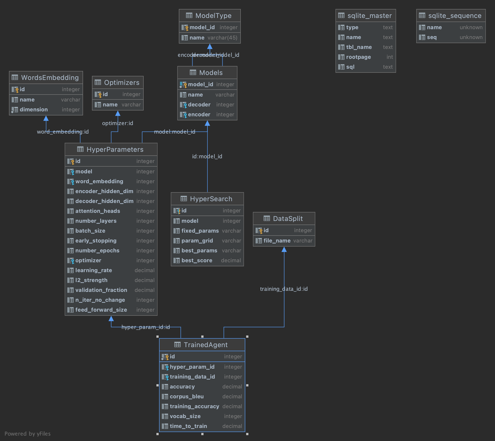

# Developing a Pragmatic framework based on Transformers

### Geoffroy de Gournay

## Abstract

Some recent NLU papers focus on building a model attuned to the fact that humans live in a social physical environment and leverage that information. RSA based models have proved to offer an interesting framework for that purpose. These models need to handle the fact that when humans speak or listen, they always reason about other minds. Recent works have been using neural networks representing literal speakers and literal listeners, as building blocks for modelling more sophisticated pragmatic listeners and speakers. The neural speakers found in current RSA studies are encoder-decoders using RNNs. This study hypothesis is that speakers can be modelled more efficiently by using Transformers rather than RNNs. These models should especially help in the hardest cases, when the speaker needs to be more specific and needs to produce longer sentences. The intuition here, is that the powerful attention mechanisms used by Transformers, should help remembering the complex grounding aspects impacting language modelling throughout the whole process of building a sentence.

## Usage instructions

### Main object used to execute tasks is TaskHandler
It can be called with the following instruction:
from project.object.task_handler import TaskHandler


### Data Needed:
Glove 100d should be downloaded and saved in project/data/datasets/glove/glove.6B.100d.txt

### Pretrained models:
Pretrained models are found in project/data/pretrained_models.
the names are always 'trained_agent_k.pt' where k corresponds to the key id in table TrainedAgent in database
color_db.sqlite


### Code Organisation
* project/data: all datasets used, pretrained models, database color_deb.sqlite
* project/models: code for different models
* project/modules: code related to embedding  and transformer architecture.
* project/object: code for TaskHandler, objects used to execute the different needed tasks for this project
* project/utils: general functions used in the rest of the project

### Organisation of models and parameters
data concerning the different models and their parameters are save in database color_db.sqlite found in
project/data/study
this database is made essentially of following tables:
* DataSplit: different splits of the data used for testing and training
* ModelType: models (GRU, transformer...)
* Models: different models of speakers and listeners
* HyperSearch: details and outcome of different hyperparameters optimization analysis
* Hyperparameters: different hyperparameters selected following the HyperSearch outcome
* TrainedAgent: the different agents with parameters that are pretrained. For each of these agent there's '.pt' file with the pretrained parameters of the model. For Agent with id=k, the file name is 'trained_agent_k.pt'. These files are found in project/data/pretrained_models.

Reading from and writing to the database is done with class ColorDB found in project/data/database.py. The schema of the database is as follow:




```python

```
